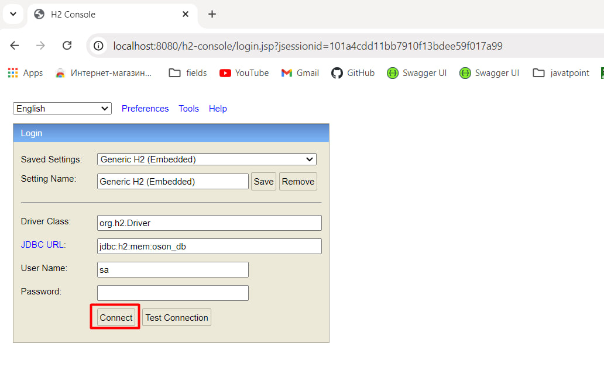
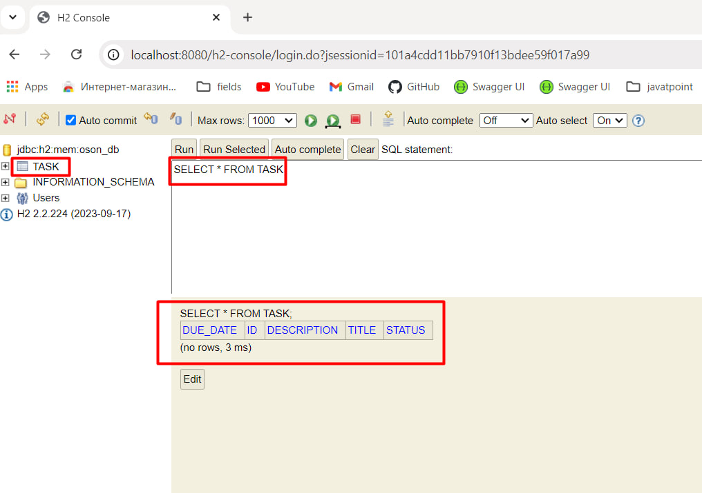
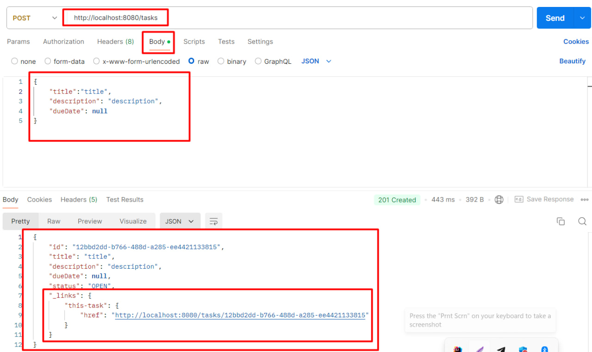
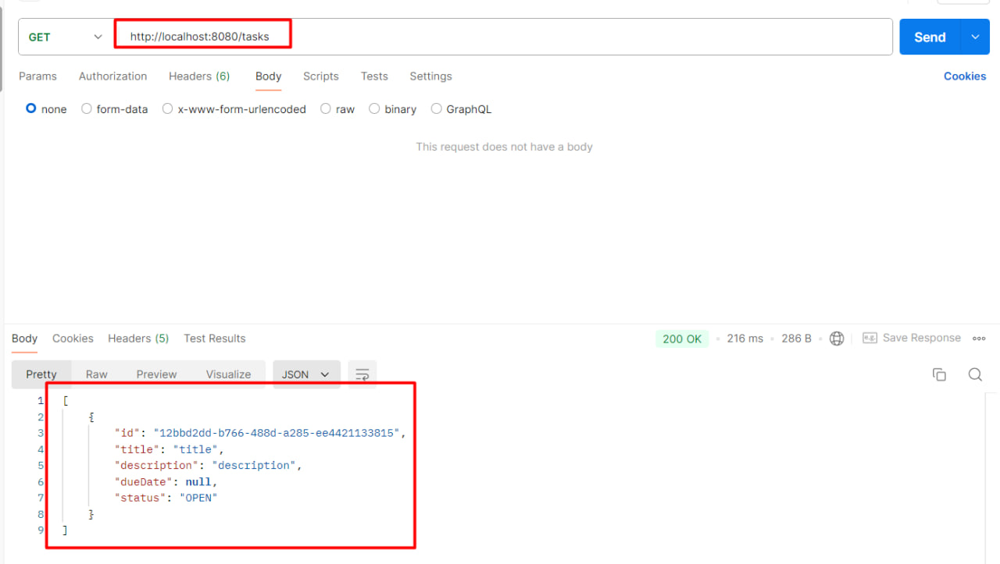
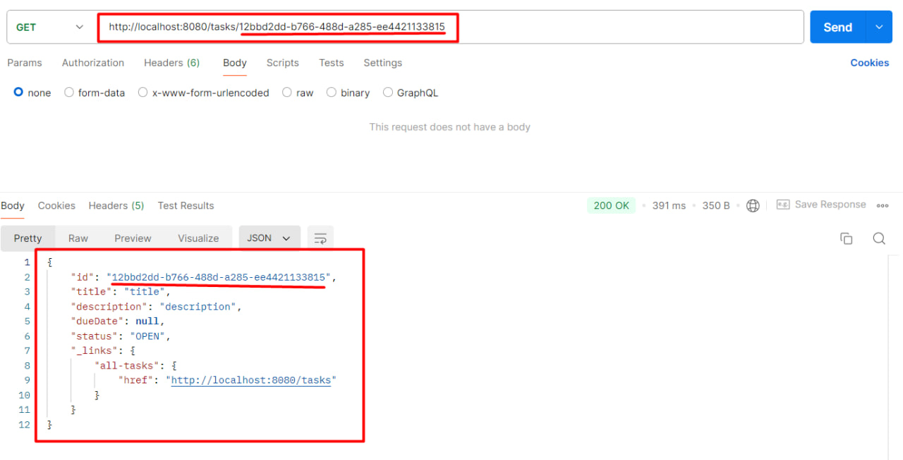
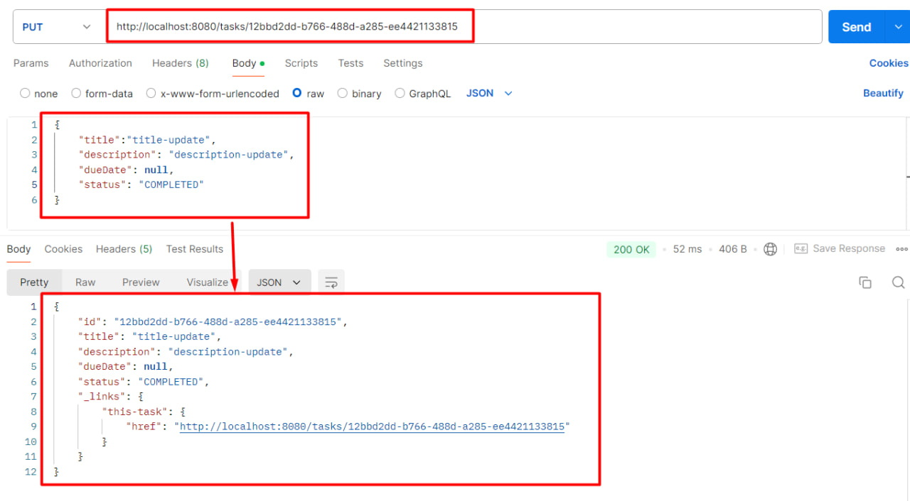
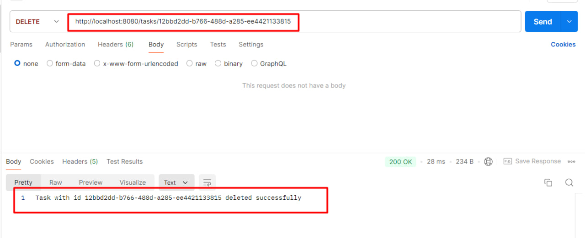

# Spring Boot 3 Observability with Grafana Stack

This project contains the source code for the [OSON.UZ](https://github.com/TokhirAsadov/task-management-system).
### by [Tokhir Asadov](https://github.com/TokhirAsadov)

## Running the project

To run the project the following command:

```mvn spring-boot:run```

## H2 database source http://localhost:8080/h2-console/



## Accessing the APIs
## 1. POST (add new task): http://localhost:8080/tasks
   

## 2. GET (all tasks): http://localhost:8080/tasks
   

## 3. GET (single tasks by id): http://localhost:8080/tasks/{id}
   

## 4. PUT (change task): http://localhost:8080/tasks/{id}
   

## 5. DELETE (delete task): http://localhost:8080/tasks/{id}
   

